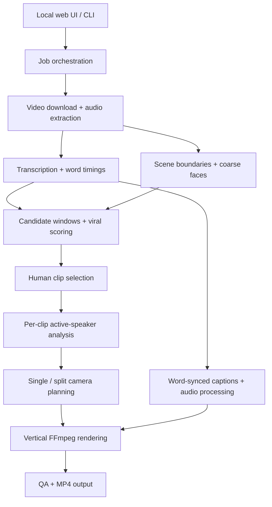

# Clipping Tool

**An AI-powered pipeline that turns long-form videos into vertical short-form clips.**

Clipping Tool combines speech transcription, scene detection, speaker analysis and
candidate ranking with a human review step. Selected moments become 1080×1920 MP4s
with active-speaker framing, word-synced captions, audio processing and output QA.

Built with Python, FastAPI, faster-whisper, MediaPipe, OpenCV and FFmpeg. It includes
a local web UI and a CLI that use the same processing engine.

> **Status:** portfolio source with a working local pipeline. Project licensing is
> pending. This repository has no automatic deployment or container publishing.
> It is a local, single-admin tool; a hosted, multi-user SaaS requires further work.

## Features

- **Video ingestion:** yt-dlp downloads supported video URLs and extracts analysis audio.
- **Speech-to-text:** faster-whisper produces transcripts with word timestamps.
- **Scene and face analysis:** PySceneDetect, MediaPipe and YuNet provide shot boundaries
  and coarse face detections.
- **Candidate selection:** transcript windows, overlap deduplication and a ranked list
  of moments; current clip durations are 75–100 seconds.
- **Scoring options:** a local heuristic works without API keys. Optional OpenAI or
  Gemini providers score candidates with a shared rubric and fall back to local scoring.
  Scores estimate editorial potential; they do not guarantee viral performance.
- **Human approval:** preview candidate text and approve the moments to render.
- **Speaker-aware framing:** mouth activity, transcript timings and audio energy drive
  a state machine for single-speaker close-ups or stacked split-screen layouts.
- **Stable virtual camera:** dead zones, smoothing, velocity limits, scene-cut resets
  and visibility fallbacks reduce crop jitter and unsafe split layouts.
- **Social-ready output:** word-synced ASS captions, audio processing, vertical MP4
  rendering, frame-count checks and QA flags.
- **Local operations:** hardware-aware encoder selection, conservative worker limits,
  cancellable jobs, progress events, disk guardrails and opt-in retention.

## Pipeline and architecture

Long-form Video → Transcription → Scene / Speaker Analysis → Candidate Detection
→ Viral Scoring → Clip Selection → Active-Speaker Reframing → Word-Synced Captions
→ Vertical Rendering → QA → MP4 Output

The coarse transcription, scene and face passes run before ranking. Detailed
active-speaker analysis runs on selected clips before camera planning and rendering.



| Component | Responsibility |
| --- | --- |
| `app/main.py`, `app/static/` | FastAPI routes, SSE progress and vanilla JavaScript UI |
| `app/cli.py`, `app/jobs.py` | CLI, job state, process pools, approval and cancellation |
| `app/pipeline/` | Ingestion, transcription, vision, framing, captions, audio and rendering |
| `app/pipeline/scoring/` | Candidate windows and interchangeable local / LLM scorers |
| `app/config.py`, `app/hardware.py` | Local settings, CPU/RAM/GPU detection and worker limits |
| `app/diskspace.py`, `app/retention.py` | Disk checks, temporary-file cleanup and retention |
| `tests/` | Synthetic rendering regressions and production-isolation checks |

## Tech stack

Python 3.12 · FastAPI / Uvicorn · vanilla HTML/CSS/JavaScript · yt-dlp ·
faster-whisper / CTranslate2 · PySceneDetect · MediaPipe Tasks · OpenCV / YuNet ·
NumPy · FFmpeg / ffprobe · optional OpenAI and Google GenAI SDKs.

## Local installation

Install **Python 3.12**, **FFmpeg with ffprobe and the ASS/subtitles filter**, and
Git. CPU processing is supported. NVIDIA CUDA, NVENC and Intel QSV are optional;
available encoders are detected rather than assumed.

On Ubuntu/Debian, install the native vision libraries as well as FFmpeg:

```bash
sudo apt-get install ffmpeg libgl1 libegl1 libgles2 libglib2.0-0 libgomp1 fonts-liberation2
```

```bash
git clone https://github.com/Saif9398/Clipping-Tool.git
cd Clipping-Tool
python3 -m venv .venv
source .venv/bin/activate
python -m pip install --upgrade pip
python -m pip install -r requirements.lock.txt
cp .env.example .env
```

On Windows PowerShell:

```powershell
python -m venv .venv
.\.venv\Scripts\Activate.ps1
python -m pip install --upgrade pip
python -m pip install -r requirements.lock.txt
Copy-Item .env.example .env
```

Alternatively, use `bash setup.sh` or `./setup.ps1`. `requirements.txt` lists direct
dependencies; `requirements.lock.txt` records the pinned environment.

The first server start downloads public vision model weights into `models/`.
The first transcription may download the selected Whisper model. Internet access
and enough disk space are required for these downloads. Models are not bundled.

## Configuration

Copy `.env.example` to `.env`. Every example value is blank; blank values select
defaults from `app/config.py`. Runtime directories are independent local folders:
`work/`, `output/` and `models/`.

| Setting | Default / purpose |
| --- | --- |
| `HOST`, `PORT` | `127.0.0.1`, `8000`; bind to loopback for local use |
| `SCORING_PROVIDER` | `local`; optional `openai` or `gemini` |
| `OPENAI_API_KEY`, `GEMINI_API_KEY` | Unset; only needed for a chosen cloud scorer |
| `ADMIN_PASSWORD` / `ADMIN_PASSWORD_SHA256` | Unset; enabling either activates the single-admin login |
| `COOKIE_SECURE` | `0` for local HTTP; use `1` behind HTTPS |
| `WHISPER_MODEL`, `WHISPER_COMPUTE` | `auto`, selected for detected hardware |
| `MAX_CONCURRENT_JOBS` | `1`, to limit resource contention |
| `RENDER_WORKERS`, `ANALYSIS_WORKERS` | `0` means hardware-aware automatic limits |
| `MAX_SOURCE_HEIGHT` | `1080`; hardware may impose a lower analysis cap |
| `RETENTION_DAYS` | `0` disables scheduled age-based deletion |
| `MIN_FREE_GB`, `WARN_FREE_GB` | `5`, `10`; local disk guardrails |

For optional cloud scoring, choose a provider and supply your own key privately in
`.env` or the settings UI. Those providers can send transcript excerpts to their
respective services and may incur API charges. Local scoring requires neither.

## Run and example workflow

```bash
python -m app.main
```

Open [http://127.0.0.1:8000](http://127.0.0.1:8000). Paste a supported video URL for
content you have permission to process, wait for analysis, review the ranked
candidates and approve selected clips. Watch progress and download the finished
MP4s. Files and manifests remain in your own `output/` directory.

The CLI runs the same engine:

```bash
python -m app.cli "<video-url>"
python -m app.cli "<video-url>" --approve 1,3
python -m app.cli --help
python -m app.doctor
```

The first command prompts for approval. `--approve all` is also available when you
want to render every ranked candidate. Stop-video cancels a local job; stop-server
and restart-server control only this application's local process.

## Test

Use a fresh local environment with no credentials. Cache the public vision models,
then run the synthetic suite and isolation tests:

```bash
python -m pip install -r requirements-dev.txt
python -c "from app.pipeline.mp_models import ensure_models; ensure_models()"
python -m pytest tests/ -v
```

The synthetic suite creates test-pattern video and fake word timings, exercises
framing and split-screen regressions, and renders through the real caption/audio/
FFmpeg path. It checks frame count, 1080×1920 dimensions and an audio stream.
It also covers job cancellation, retention, auth, configuration and mocked hardware
selection. Test media is generated locally and is excluded from version control.
These tests do not measure real speech recognition accuracy or content virality.

## Optional local container

The Dockerfile retains a CUDA runtime for machines that support GPU acceleration.
It has no publishing or deployment automation. Build a separate local image:

```bash
docker build -t clipping-tool:local .
docker run --rm --name clipping-tool-local \
  -p 127.0.0.1:8000:8000 \
  -v clipping-tool-data:/data/clipping-tool \
  clipping-tool:local
```

Add `--gpus all` only on a properly configured NVIDIA host. Add `--env-file .env`
to supply your own private configuration. Container data uses its own volume;
retention is disabled by default. The example binds the published port to loopback.
No registry package is published by this repository.

## Security and data handling

- Source control contains code and blank configuration examples. `.gitignore` and
  `.dockerignore` exclude secrets, sessions, settings, models, media, logs and databases.
- Run this as a trusted local tool. Authentication is disabled until configured;
  loopback binding is the default. Do not expose an unauthenticated instance.
- Login protects APIs and rendered clips when enabled. The settings API reports
  key presence rather than returning saved key values.
- UI settings are saved in `work/settings.json`; an automatically generated session
  secret lives in `work/.session_secret`. Protect these local files and do not share them.
- Use separate directories and volumes. Maintenance and retention controls can delete
  files inside the configured runtime directories; never point them at another system.
- Hosted operation needs additional work: user isolation, stronger authentication,
  authorization, CSRF/rate-limit controls, URL ingestion restrictions and resource quotas.
- There are no cloud lifecycle APIs, production credentials, deployment workflows,
  automatic registry publishing or links to another application's infrastructure.

## Screenshots and demo

**Screenshot placeholder:** add a capture of the local UI using your own synthetic
or explicitly cleared media after reviewing it for keys, account details and private URLs.

**Demo placeholder:** add a short walkthrough of ingestion, candidate review and a
vertical output. No demo media or performance claims are included yet.

## Project status and licensing

This repository demonstrates the processing engine and local application architecture.
A hosted commercial service would require a separate product, infrastructure and
security review. No commercial rebrand or domain integration is configured here.

**Project license: pending.** No project-wide open-source license has been added.
Public visibility alone does not grant a general right to reuse, modify or redistribute
the code. Dependencies and model weights retain their own terms; see
[attribution and provenance notes](docs/ATTRIBUTION.md).
